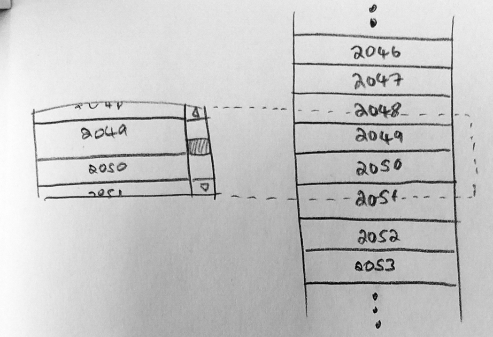

# kỹ thuật " UI Virtualization "
- react gặp khó khăn trong quá trình render lặp lại số lượng element lớn
=> kỹ thuật trên giúp chỉ render một vài trong số chúng nhằm giúp screen trông mượt hơn.

thư viện hỗ trợ: react virtualized

đặc điểm:
-  tính toán những item được visisble  trong khu vực danh sách đực display
- sử dụng một một container với thuộc tính relate position và các chidlren của nó có thuộc tính absolute position và control các props như top, left ,width, height.

có 5 năm component chính

+ Grid. It renders tabular data along the vertical and horizontal axes.
+ List. It renders a list of elements using a Grid component internally.
+ Table. It renders a table with a fixed header and vertically scrollable body + content. It also uses a Grid component internally.
+ Masonry. It renders dynamically-sized, user-positioned cells with vertical scrolling support.
+ Collection. It renders arbitrarily positioned and overlapping data.

https://medium.com/@yudhajitadhikary/optimize-your-code-by-using-react-virtualized-a9c814031c27

